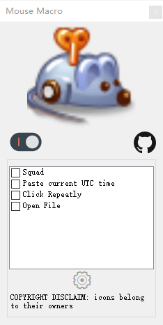

# Mouse Macro
Versatile, configurable, easy reprogrammable macro application for both mouse and keyboard. it can

* simulate repetitively mouse clicks particular useful for MMORPG game (like WoW, ARK and ATLAS). release your chore of endlessly clicks to attack.
* simulate to compensate firearm recoil in FPS game Squad, so your gunfire is easy, stable and accurate.
* and other mods.

## Screenshoot

## Requirement

* Window 10
* .Net Framework 4.7.2

## Download 

you can download compiled executable from my [baidu Cloud Disk](https://pan.baidu.com/s/1tUXBKcouEG7hbYGleozDmA)

Last version 2018/12/27

## Usage
* download the zip file
* unzip
* open the only .exe file ***n43e120.MouseMacro.exe***

## Squad Mod 

> Press **[F5]** to switch to AK-74 Auto mode for FPS video game Squad.
> this is out-of-box example of demostration
> now click left mouse button, it should be move down automatically as you hold down LMB.
> **[F6]** for M4 burst mode for FPS video game Squad.
> **[F7]** for pistol mode for FPS video game Squad.
> **[F8]** to stop it, press F8 again to return previous mode.

> click **Setting button** on the **app window**.
> and then click **MacroControllers** item in the list on the **Setting Window**
> and then click **Squad** item on the **IMacroController Collection Editor Window**
> and then click the **Left Mouse Button** item to open a dropdown menu.
> in the dropdown menu you can choose one of many other gun fire modes you want, there are many of them.

## DIY Mod Guide 
* write a new macro can not be more easy. just write a static C# class and static method and attach [MarcoAction] attribute to your method.
* If you create your own put your dll or exe file into **/mod** folder and there you go.
* it is designed to open-source, so that users can make variant of system of their own to fit to other FPS game, other purposes, etc.

